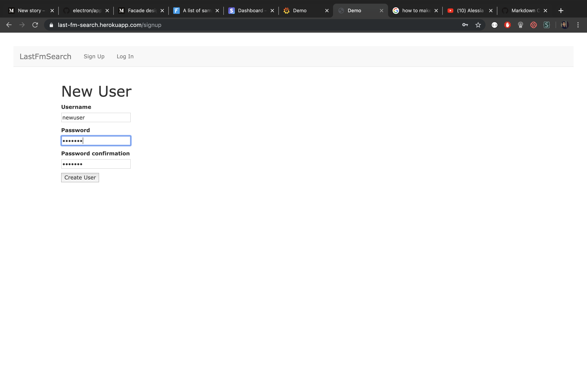
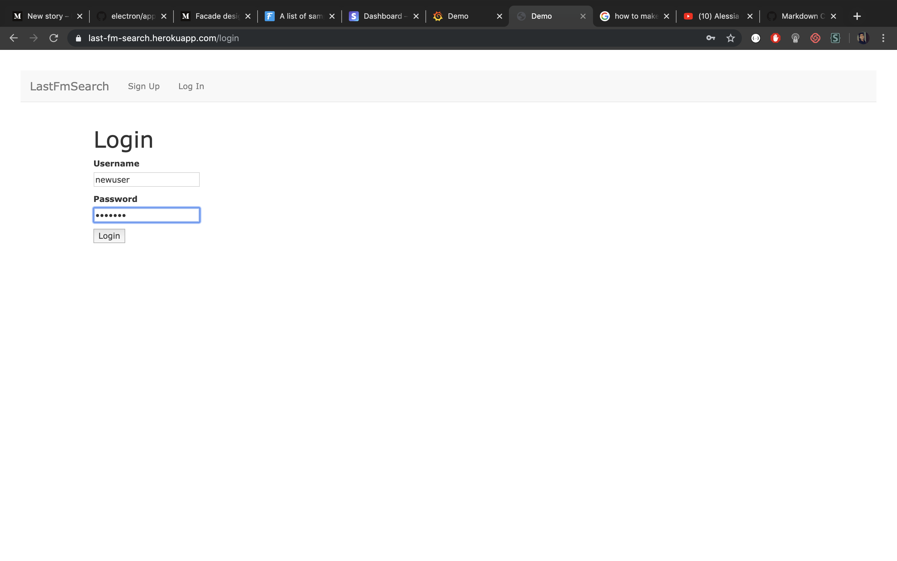
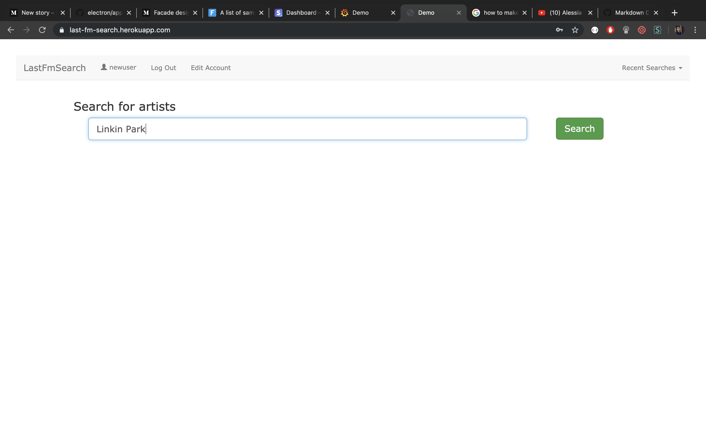
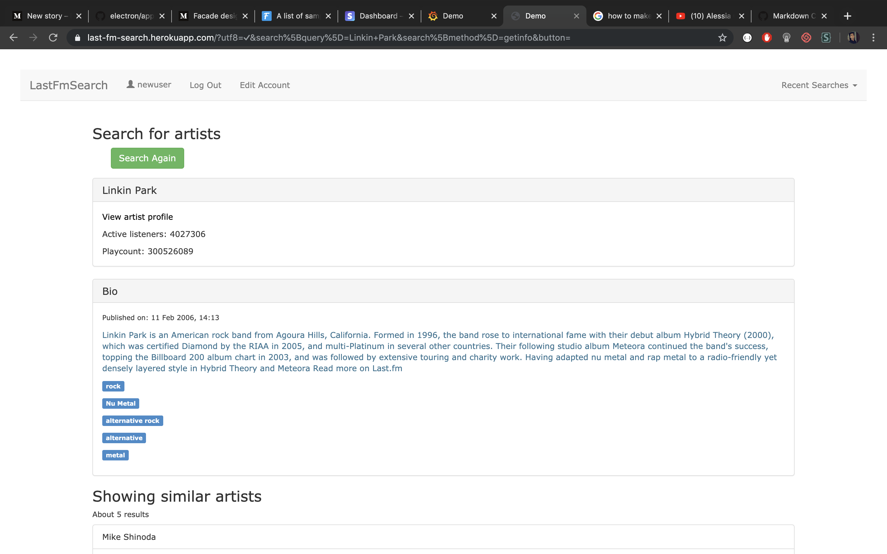

## Last FM API Search App
---
 

<i>This is a simple web app which interacts with the [last fm](https://www.last.fm/) API and displays information related to your favourite artist. </i>
___
### Live demo
---
This app is still under development. As a result, it shouldn't be considered as finished product. 

[A live demo can be found here](https://last-fm-search.herokuapp.com/) - have fun!

### Getting started
---
1) Create an account.
2) Log in using the newly created account credentials.
3) Type in the name of the artist you want to look up and hit search.
4) Search results will be displayed on the page.

Refer the screenshots

1) Signup

2) Login

3) Type in artist name

4) Check it out, it works!

Tech Stack
---

| Tech      | Version |
| ----------|:-------:|
| Rails     | 5.2.3   |
| Postgres  | 0.18.4  |
| Ruby      | 2.5.0   |
---